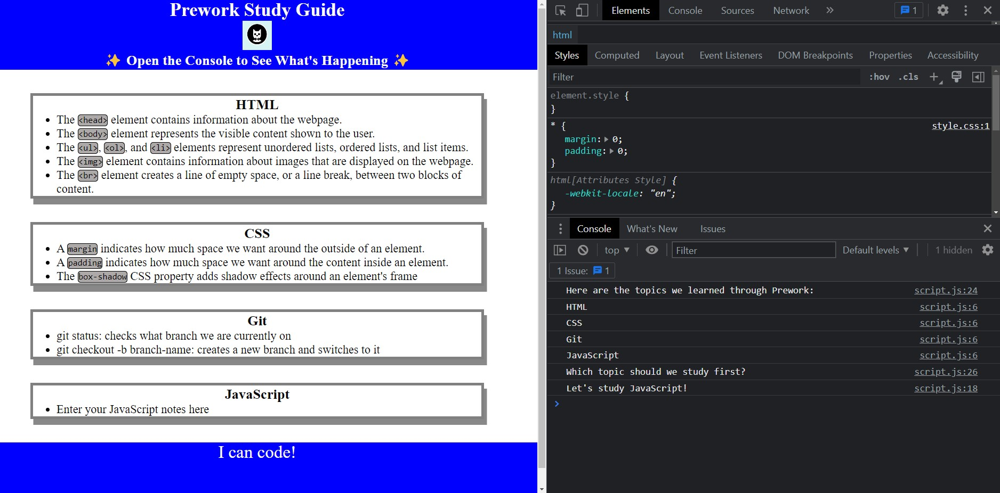

# Prework Study Guide Webpage :book:

## Description :scroll:

A study guide that contains important information from the bootcamp's prework.
This project eliminates the tedious task of looking over numerous modules for specific key points.
Here you are able to learn about crucial programming information with ease.
This study guide contains notes on HTML, CSS, Git, and JavaScript.

## Installation :package:

N/A

## Usage :pencil:

To use this Prework Study Guide, you can review the notes in each section. For suggestions on what to study first, open the Chrome DevTools by pressing Command+Option+I (macOS) or Control+Shift+I (Windows). A console panel should open either below or to the side of the webpage in the browser. There you will see a list of topics we learned from the prework along with a suggestion on which topic to study first.

    

## Credits :hammer_and_pick:

N/A

## License :key:

Please refer to the LICENSE in the repo.

